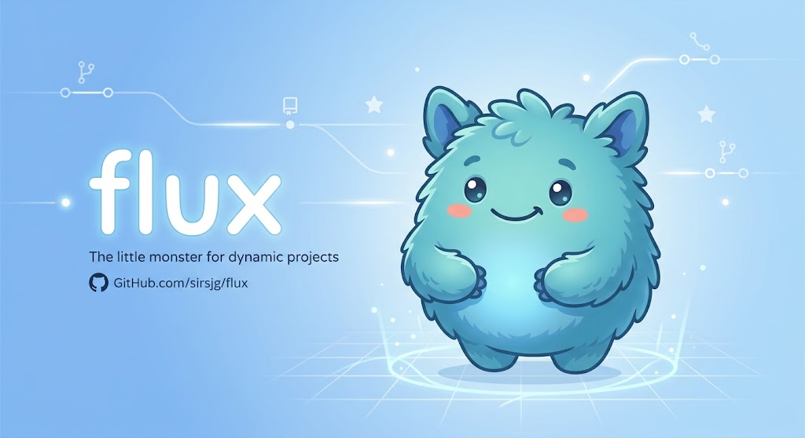
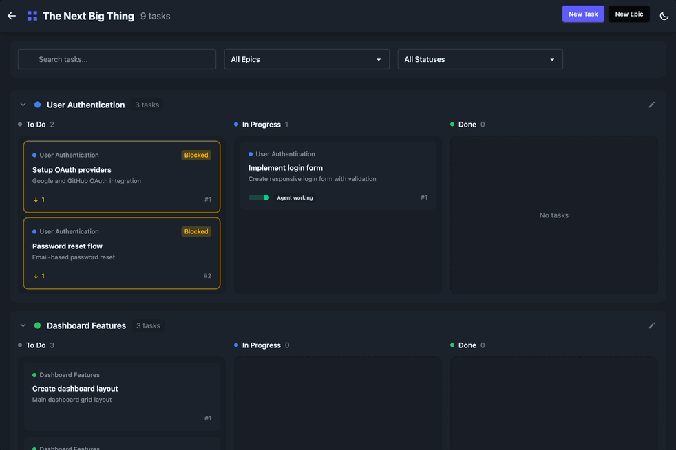

# Flux &middot; [](https://github.com/sirsjg/flux/actions/workflows/ci.yml) [](LICENSE)     

> An open, hackable, execution-agnostic task management engine for humans and AI agents.

<p align="center">
  
</p>

Flux is a fast, multi-project Kanban board that humans, AI agents, and automations share. Tasks live in a single JSON file in your repo, synced through git. A CLI, web dashboard, REST API, webhooks, and an MCP (Model Context Protocol) server all read and write the same data — so *where* tasks live is fixed, but *how* they get done is entirely up to you: manually, through the API, via webhooks, or by handing the board to an AI assistant.



## Why Flux

- **Execution-agnostic** — Flux tracks the work; it doesn't prescribe how the work happens. Humans, scripts, CI pipelines, and LLMs are all first-class actors.
- **AI-native** — a full MCP server lets assistants list, create, update, and close tasks programmatically, with agent memory (task comments), priorities, and dependency tracking designed for autonomous work.
- **Simple and fast** — a single JSON file, drag-and-drop UI, zero-dependency CLI. No database to run, no SaaS lock-in.
- **Git-native** — task data syncs through a `flux-data` branch with `flux push` / `flux pull`, so your board travels with your repo and works offline.

## Features

- **Multi-project Kanban boards** with epics, tasks, and drag-and-drop status changes
- **Task dependencies** — blocked tasks are flagged visually and excluded from `flux ready`
- **Priority system** — P0/P1/P2 priorities for ordering agent (and human) work
- **CLI-first** — full terminal workflow with MCP parity (`flux ready`, `flux task`, …)
- **MCP integration** — 25+ tools covering projects, epics, tasks, comments, webhooks, and blobs
- **Agent memory** — task comments persist context across assistant sessions
- **REST API** — full endpoints for automations, integrations, and custom frontends
- **Webhooks** — signed, retried deliveries on task changes for Slack, GitHub, CI/CD, and more
- **Real-time updates** — boards stay in sync over SSE, with opt-in browser notifications
- **Blob storage** — attach files (images, docs, logs) to tasks via CLI, API, or MCP
- **Git-native sync** — `flux push` / `flux pull` against a `flux-data` branch

## Quick Start

```bash
# CLI only (npm)
npm install -g flux-tasks

# Full stack with web UI (Docker)
curl -fsSL https://raw.githubusercontent.com/sirsjg/flux/main/scripts/quickstart.sh | bash  # macOS/Linux
irm https://raw.githubusercontent.com/sirsjg/flux/main/scripts/quickstart.ps1 | iex         # Windows
```

The quickstart starts the web UI at [http://localhost:3000](http://localhost:3000) (bound to localhost only) and an MCP server on stdio. Press Ctrl+C to stop the MCP server when you're done.

The server is locked by default when exposed beyond localhost: set `FLUX_API_KEY` to enable authenticated access on a network, or `FLUX_ALLOW_ANONYMOUS=1` to explicitly allow open access. See [`docs/api.md`](docs/api.md) for auth modes and key scopes.

## Using Flux with AI Assistants

Flux ships an MCP server (`packages/mcp`) that runs on **stdio** for local clients or over **Streamable HTTP** for remote ones. Full tool reference: [`docs/mcp.md`](docs/mcp.md).

### Claude Code & Codex

With the Docker quickstart running:

```bash
# Claude Code
claude mcp add flux -- docker exec -i flux-web bun packages/mcp/dist/index.js

# Codex
codex mcp add flux -- docker exec -i flux-web bun packages/mcp/dist/index.js
```

There is also a [Claude Code plugin](docs/claude-code-plugin.md) that turns project requirements into a structured Flux board with epics, tasks, and dependencies.

### Claude Desktop & ChatGPT

Both connect over stdio using a local config file — see [`docs/assistant-setup.md`](docs/assistant-setup.md) for the exact configuration.

### Claude Cowork

Claude Cowork connects to MCP servers as **remote custom connectors**: the connection originates from Anthropic's infrastructure, not your machine, so a local stdio server won't work. Instead, run the Flux MCP server in HTTP mode and make it reachable over the public internet:

```bash
# Serve the MCP Streamable HTTP transport at /mcp (requires Bun)
FLUX_MCP_TOKEN=<secret> bun packages/mcp/dist/index.js --http --port=3001
```

1. Expose the endpoint publicly — a hosted deployment, reverse proxy, or a tunnel (e.g. `cloudflared` or `ngrok`) for testing.
2. In your Claude account, go to **Settings → Connectors → Add custom connector** and enter the server URL (e.g. `https://your-host/mcp`). Cowork uses account-level connectors, so this is configured on claude.ai rather than inside the app.
3. Enable the connector in Cowork and confirm the Flux tools appear.

The HTTP endpoint is unauthenticated by default — set `FLUX_MCP_TOKEN` to require a bearer token before exposing it beyond localhost, and see [`docs/mcp.md`](docs/mcp.md) for remote-server mode (`FLUX_SERVER` / `FLUX_API_KEY`) if the MCP server should talk to a hosted Flux API instead of local storage.

### Ground rules for agents

Add a Flux section to your project's agent instructions (`AGENTS.md`, `CLAUDE.md`, or equivalent) so assistants use the board reliably. The snippet below covers the workflow rules Flux actually enforces plus the conventions that keep a shared board coherent:

```bash
cat << 'EOF' >> AGENTS.md

## Flux task management

You have access to Flux for task management, via MCP tools or the `flux` CLI.

Project scope:
- All work belongs to exactly one project. On startup, list projects, then
  select or create one and confirm its project_id before doing any work.
- Include that project_id in every Flux call. Never guess a project_id, and
  never switch projects without explicit instruction.

Working a task:
- Track all work as tasks. Pick the next task with `list_ready_tasks` (or
  `flux ready`) — it excludes blocked tasks and sorts by priority (P0 first).
- Set status to in_progress when you start and done as soon as you finish.
  Tasks in planning must move to todo before in_progress.
- Pass your agent_name on status changes so the board shows who is working.
- Don't start a task whose dependencies aren't done.

Memory and scope:
- Record decisions, findings, and blockers as task comments — they are your
  memory across sessions. Check a task's comments before starting it.
- When you discover new work, create a task for it (with acceptance criteria)
  rather than expanding the current task's scope.

If you lose context or are unsure of the project_id, stop, re-list projects
and tasks, and ask the user if ambiguity remains.
EOF
```

## Documentation

- [`docs/installation-docker.md`](docs/installation-docker.md) — production-ready Docker stack with a shared data volume
- [`docs/installation-source.md`](docs/installation-source.md) — build from source and set up a local dev workflow
- [`docs/cli.md`](docs/cli.md) — full CLI reference with MCP parity
- [`docs/claude-code-plugin.md`](docs/claude-code-plugin.md) — Claude Code plugin for spec-driven board generation
- [`docs/assistant-setup.md`](docs/assistant-setup.md) — connect Claude Desktop, Claude Cowork, or ChatGPT with best-practice guardrails
- [`docs/mcp.md`](docs/mcp.md) — the complete MCP surface: tools, resources, prompts, and transports
- [`docs/api.md`](docs/api.md) — REST endpoints for automations, integrations, and custom frontends
- [`docs/webhooks.md`](docs/webhooks.md) — real-time events with signatures, retries, and examples
- [`docs/architecture.md`](docs/architecture.md) — the monorepo, storage model, and design decisions
- [`docs/ideas.md`](docs/ideas.md) — ways to use Flux, from agent swarms to automation-first workflows
- [`docs/roadmap.md`](docs/roadmap.md) — where Flux is headed next

## Ecosystem

Flux's CLI, REST API, webhooks, and MCP server make it easy to compose with other tools:

### Agents & assistants

| Tool | How it pairs with Flux |
|------|------------------------|
| [Momentum](https://github.com/sirsjg/momentum) | Watches Flux for task changes and automatically spawns agents to work on them |
| [Claude Agent SDK](https://code.claude.com/docs/en/agent-sdk) | Build custom autonomous agents that plan, pick up, and close Flux tasks through the MCP tools |
| [Goose](https://github.com/block/goose) | Open-source, MCP-native agent — point it at the Flux MCP server and let it work ready tasks |
| [Cursor](https://cursor.com) / [Cline](https://github.com/cline/cline) / [Zed](https://zed.dev) | MCP-capable editors and coding agents that can read and update the board while they code |

### Planning & automation

| Tool | How it pairs with Flux |
|------|------------------------|
| [Spec Kit](https://github.com/github/spec-kit) | Create spec-driven requirements that generate Flux epics and tasks |
| [GitHub Actions](https://github.com/features/actions) | Drive the board from CI — close tasks on merge, create tasks from failed runs, or `flux push` on a schedule |
| [n8n](https://github.com/n8n-io/n8n) | Self-hosted workflow automation triggered by Flux webhooks |
| [Zapier](https://zapier.com) | Connect Flux to 5,000+ apps via the REST API and webhooks |
| [Slack](https://api.slack.com/messaging/webhooks) | Post task updates to a channel via Flux webhooks — see [`docs/webhooks.md`](docs/webhooks.md) |
| [cloudflared](https://github.com/cloudflare/cloudflared) / [ngrok](https://ngrok.com) | Tunnel the MCP HTTP endpoint so Claude Cowork and claude.ai connectors can reach it |

## Contributing

Flux is early and moving quickly. Open an issue for ideas and bugs, or pick something from the [roadmap](docs/roadmap.md) and send a PR. See [`CONTRIBUTING.md`](CONTRIBUTING.md) for details.

## License

MIT. See [`LICENSE`](LICENSE).
